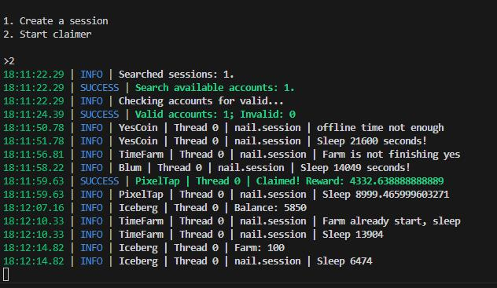

# Crypto Game Bots

## Overview
This program provides bots for various crypto games _like Blum, YesCoin, PixelTap, Iceberg and TimeFarm_. The program is currently under development and is being continually updated with new features.

## Instructions

1. **Create Sessions**
    - Start the program and press the number `1`. This step is necessary to create sessions and authenticate the user.

2. **Run the Bot**
    - Once sessions are created, you can press the number `2` to start the bot.
        - 

## Development Status
Please note that the program is still under development. New features and improvements are being added regularly. If you encounter any issues or have suggestions for enhancements, feel free to contribute or open an issue.

## Contributing
Contributions are welcome! If you have any ideas for new features or find any bugs, please open an issue or submit a pull request.

## License
This project is licensed under the MIT License.
